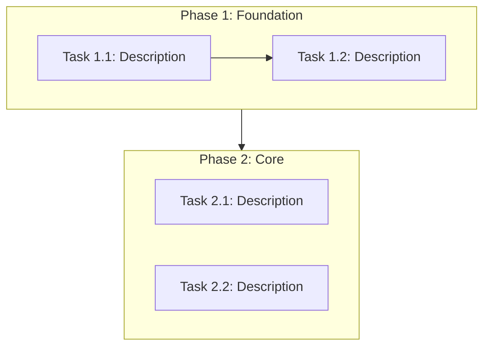

# Plan Document Templates

Templates for the three documents generated in Phase 2 (Task Decomposition). Output to `docs/plan/`.

---

## task-breakdown.md

```markdown
# Task Breakdown

## Overview
- **Total Phases**: N
- **Total Tasks**: N
- **Estimated Total Effort**: S/M/L/XL

## S.U.P.E.R Design Constraints

> All tasks in this plan must produce code that conforms to S.U.P.E.R architecture principles. The following constraints apply globally:

- **S (Single Purpose)**: Each new module/file/function solves exactly one problem. If a task spans multiple responsibilities, decompose it further.
- **U (Unidirectional Flow)**: Data flows input → processing → output. Dependencies point inward. No circular imports.
- **P (Ports over Implementation)**: Define interface contracts (schemas, types) before implementation. All cross-module I/O must be serializable.
- **E (Environment-Agnostic)**: No hardcoded config. All env-specific values from environment variables or config files.
- **R (Replaceable Parts)**: Each component must be replaceable without cascading changes. Validate with the replacement test: "Can I swap this with a different implementation by only touching this module?"

## Phase 1: <Phase Name>
**Goal**: What this phase achieves
**Prerequisite**: What must be done before this phase
**S.U.P.E.R Focus**: Which S.U.P.E.R principles are most relevant to this phase (e.g., "P — defining interface contracts before implementing modules")

| # | Task | Priority | Effort | Depends On | Lane | S.U.P.E.R | Acceptance Criteria |
|:--|:-----|:---------|:-------|:-----------|:-----|:----------|:--------------------|
| 1 |      | P0       | M      | —          | A    | S, P      |                     |
| 2 |      | P1       | S      | —          | B    | U, E      |                     |
| 3 |      | P1       | S      | 1          | A    | R         |                     |

> **S.U.P.E.R column**: Lists which S.U.P.E.R principles are the primary design drivers for this task. The agent implementing this task must pay special attention to these principles. Every task's acceptance criteria implicitly includes: "Passes the S.U.P.E.R Quick Check for the listed principles."

### Parallel Lanes
| Lane | Tasks | Combined Effort | Merge Risk | Key Files |
|:-----|:------|:----------------|:-----------|:----------|
| A    | 1, 3  | M               | Low        |           |
| B    | 2     | S               | Low        |           |

> Tasks in different lanes have no mutual dependencies and can be executed simultaneously by separate `task-executor` sub-agents. Merge risk indicates the likelihood of file conflicts between lanes.

## Phase 2: <Phase Name>
<!-- Same structure as Phase 1 -->
```

---

## dependency-graph.md

````markdown
# Task Dependency Graph


````

---

## milestones.md

```markdown
# Milestones

| # | Milestone | Target Phase | Criteria | Status |
|:--|:----------|:-------------|:---------|:-------|
| 1 |           | After Phase 1|          | Pending |
| 2 |           | After Phase 3|          | Pending |
```
